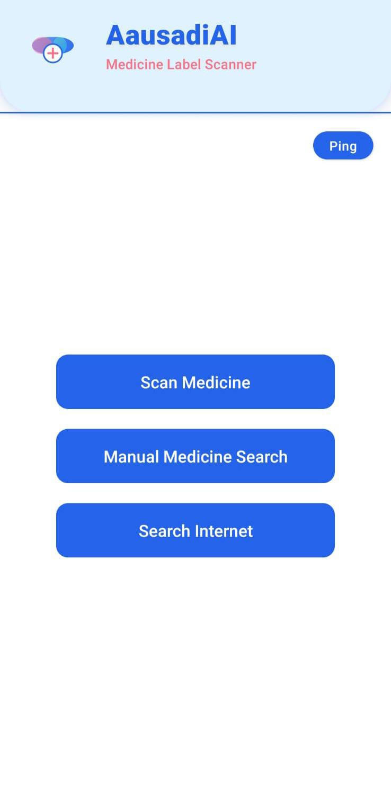
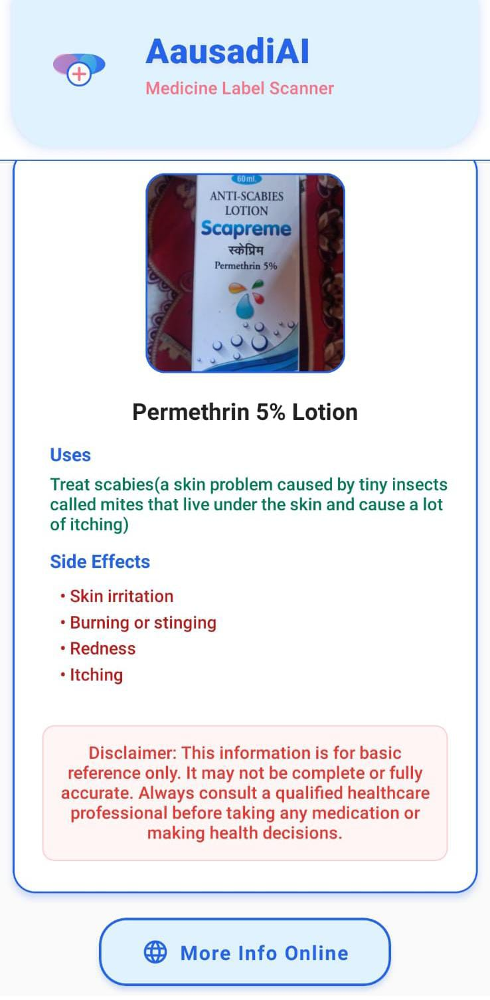

# Ausadhi AI: Smart Medicine Information Assistant

**Ausadhi AI** is a mobile application developed as a final year project. It serves as a smart medicine companion, allowing users to quickly get detailed information about medicines either by scanning the packaging with their camera or by searching manually.

The project leverages a powerful combination of a React Native mobile frontend and a Python backend with custom-trained Machine Learning models for Optical Character Recognition (OCR) and Natural Language Processing (NLP).


## 📸 Screenshots

 

These screenshots show:
- 📷 The OCR-based scanning interface.
- 🧠 The display of extracted medicine data in the app.

---

## 🌟 Key Features


*   📷 **Scan Medicine Strips:** Instantly identify medicines by taking a picture of the box or strip.
*   🔍 **Intelligent Text Recognition:** Utilizes OCR to extract text from the image and a custom-trained Named Entity Recognition (NER) model to accurately identify the medicine's name.
*   ℹ️ **Comprehensive Details:** Get detailed information including the medicine's uses, side effects, composition, and dosage from a comprehensive dataset.
*   ✍️ **Manual Search:** A robust search feature to manually look up medicine information if you don't have the packaging.
*   🌐 **Integrated Web Search:** An option to search for more information on the internet directly from the app.

## ⚙️ How It Works

The application consists of two main components:

1.  **Mobile Client (React Native):** The user interacts with the app on their phone. It handles camera access, image uploads, and displaying the final information in a user-friendly interface.
2.  **Backend Server (Python):** This server is the brain of the operation.
    *   It receives an image from the mobile client.
    *   An **OCR model** scans the image and extracts all visible text.
    *   A **custom NLP (NER) model**, trained on medicine data, processes the text to find the specific drug names.
    *   It then looks up the identified drug in a local database (from `medicine_dataset.csv`).
    *   Finally, it returns the structured information to the app for display.

## 🛠️ Technology Stack

*   **Frontend:**
    *   [React Native](https://reactnative.dev/)
    *   [Expo](https://expo.dev/)
*   **Backend:**
    *   [Python](https://www.python.org/)
    *   [Flask](https://flask.palletsprojects.com/) / [FastAPI](https://fastapi.tiangolo.com/)
    *   [spaCy](https://spacy.io/) (for the custom NER model)
    *   OCR Library (e.g., EasyOCR, Tesseract)
*   **Database:**
    *   CSV-based file storage.

## 🚀 Getting Started

To get a local copy up and running, follow these simple steps.

### Prerequisites

*   Node.js and npm
*   Python 3.8+ and pip
*   Git

### Installation & Setup

1.  **Clone the repository:**
    ```sh
    git clone https://github.com/anupghimire12/AausadiAI.git
    cd AausadiAI
    ```

2.  **Setup the Backend Server:**
    ```sh
    cd Server
    pip install -r requirements.txt
    python main.py
    ```
    The server will start, typically on `http://127.0.0.1:5000`.

3.  **Setup the Mobile Client:**
    ```sh
    cd ../client
    npm install
    ```
    *Important: You will need to update the server URL in the client-side code (likely in `App.js` or a config file) to point to your computer's local IP address where the server is running.*
    ```sh
    npx expo start
    ```
    Scan the QR code with the Expo Go app on your phone to run the application.

## 📄 License

Distributed under the MIT License.

## 👨‍💻 Author

*   **Anup Ghimire** - [anupghimire12](https://github.com/anupghimire12)
